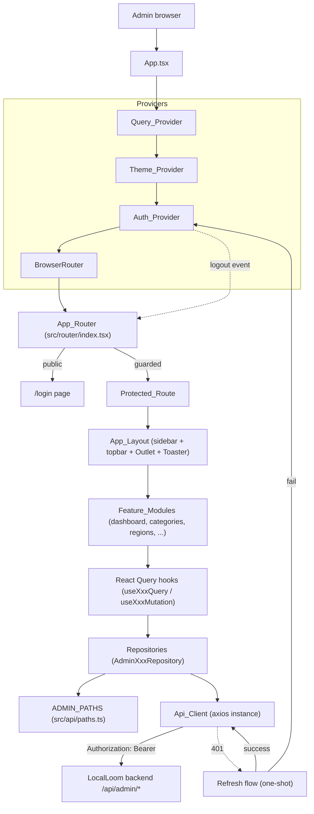
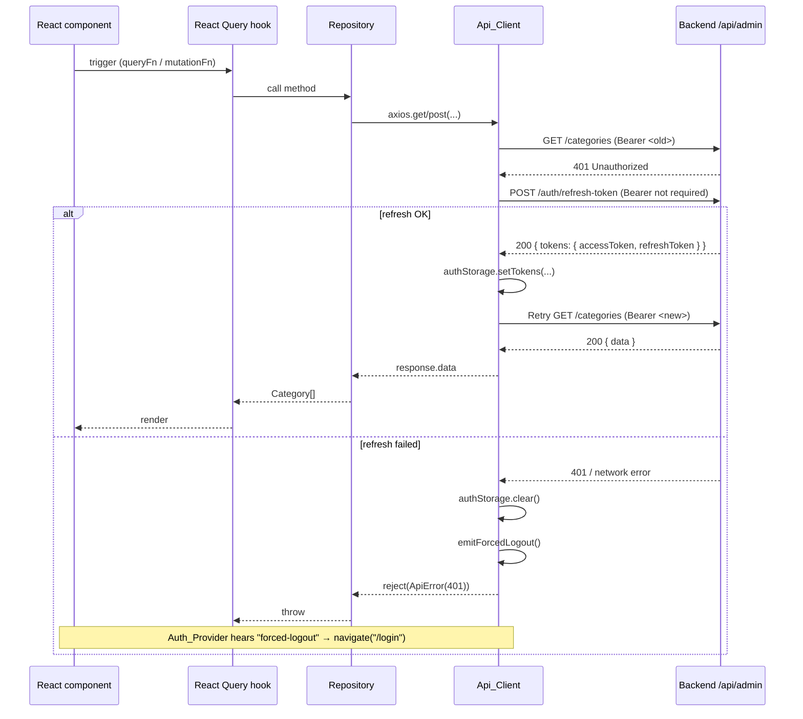

# Design Document

## Overview

The LocalLoom Admin Panel is a standalone single-page React application that consumes the LocalLoom backend's admin API surface mounted under `${VITE_API_BASE_URL}/api/admin`. Its job is to give the administrator a themeable, authenticated workspace for curating catalog and geography data today (categories, regions) and to ship with a structural scaffold that slots in Users, Tradies, Reviews, Reports, Dashboard statistics, and Suburbs the moment those backend routes ship, with zero rework of the shell, auth layer, or HTTP plumbing.

This design is aligned one-to-one with the 14 requirements. It covers both the high-level architecture (providers, routing, layer boundaries) and the low-level shapes (file paths, class/function signatures, pseudocode for the critical components). Where the requirements left a decision open, this document makes the call explicitly and cites the requirement it is binding to.

### Design Goals Mapped to Requirements

| Goal | Requirements |
|---|---|
| Standardized Vite + React + TS + shadcn/ui + React Query + RHF + Zod stack | 1 |
| shadcn/ui is the only primitive source; extensions live in wrappers | 2 |
| One-token-change retheme via CSS variables and Tailwind mapping | 3 |
| Single Api_Client + ADMIN_PATHS + per-resource Repository + React Query hooks | 4 |
| Email/password login, profile hydration, refresh-on-401, redirectTo | 5 |
| Sidebar + top bar + user menu + responsive Sheet + global Toaster | 6 |
| Dashboard landing with profile info and placeholder counts | 7 |
| Categories CRUD with multipart icon, validation, conflict handling | 8 |
| Regions CRUD with JSON body, validation, soft delete | 9 |
| Placeholder modules (Users/Tradies/Reviews/Reports) gated by feature flags | 10 |
| Every non-login route is behind Protected_Route; 401 after refresh → /login | 11 |
| Conventional folder layout; App.tsx composes providers only | 12 |
| Steering_Rules_File capturing every mandatory standard | 13 |
| Typed, zod-validated env module; static-hostable build | 14 |

### Key Design Decisions

1. **Single admin baseURL baked into Api_Client**: `baseURL = \`${env.apiBaseUrl}/api/admin\``. Repositories use paths like `"/categories"` — they never prepend `/api/admin`. This matches Requirement 4.1 and keeps `ADMIN_PATHS` values short.
2. **Auth storage is localStorage, not cookies**: The backend admin auth is header-based (`Authorization: Bearer`) and the login response returns both tokens in the JSON body. Keys are `localloom-admin-access-token`, `localloom-admin-refresh-token`, `localloom-admin-profile` (Requirement 5.3).
3. **Refresh-on-401 is a one-shot per original request**: A request-scoped flag prevents infinite loops and cooperates with a shared in-flight refresh promise so concurrent 401s share one refresh call (Requirement 4.3, 4.4).
4. **Toasts are the default error surface; form fields get errors only when the backend maps them to field names** (Requirement 4.11, 8.7, 8.8).
5. **No PBT**: The feature is UI + CRUD + configuration. There are no universal properties worth validating across 100+ generated inputs. Testing is example-based (unit, integration, a small Playwright smoke pass). See Testing Strategy for why and how.

---

## Architecture

### High-Level System Diagram



### Request Path Summary

1. UI dispatches an action → React Query hook
2. Hook calls Repository method
3. Repository constructs URL from `ADMIN_PATHS` and calls Api_Client (`get` / `post` / `patch` / `delete`)
4. Api_Client request interceptor attaches `Authorization: Bearer <accessToken>` from Auth_Storage
5. Backend responds; Api_Client response interceptor either passes through, normalizes to `ApiError`, or runs the refresh-on-401 dance
6. Hook either caches the result (queries) or invalidates affected query keys (mutations)
7. Component renders data / shows toast / displays field errors

### Tech Stack and Rationale

| Dependency | Version target | Why |
|---|---|---|
| `vite` + `@vitejs/plugin-react` | latest 5.x | Fast dev server, ESM-native, official React-TS template (Req 1.1) |
| `react`, `react-dom` | ^18 | Concurrent rendering, stable with React Query v5 (Req 1.2) |
| `react-router-dom` | ^6 | Data router with nested layout routes and loader-free protection via element guards (Req 1.2, 11) |
| `typescript` | ^5 | Strict type safety across API envelopes and forms (Req 1.3) |
| `tailwindcss`, `postcss`, `autoprefixer` | latest | Utility styling that shadcn depends on (Req 1.4) |
| `class-variance-authority`, `clsx`, `tailwind-merge`, `lucide-react` | latest | shadcn prerequisites; `cn` helper (Req 1.4, 2.7) |
| `axios` | ^1 | Interceptors, cancellation, multipart, widely understood (Req 1.5, 4) |
| `@tanstack/react-query` | ^5 | Caching, background refetch, mutation invalidation (Req 1.6, 4.9, 4.10) |
| `react-hook-form`, `zod`, `@hookform/resolvers` | latest | Uncontrolled forms with schema validation (Req 1.7, 8, 9) |
| `sonner` (or shadcn `toast`) | latest | Globally mounted toaster (Req 4.11, 6.6). We will use the shadcn `toast` + `Toaster` pair because the shadcn CLI installs it and Req 4.11 calls out "the shadcn toast primitive" |
| `eslint`, `@typescript-eslint/*`, `prettier` | latest | Lint + format scripts (Req 1.10) |
| `vitest`, `@testing-library/react`, `@testing-library/user-event`, `msw` | latest | Unit + component testing + mocked HTTP (Testing Strategy) |

No library is hand-rolled; no primitive is reinvented. Every UI primitive comes from shadcn's CLI (Req 2.1, 2.2).

### Folder Structure

```
localloom-admin/
├── .env.example
├── .eslintrc.cjs                  (or eslint.config.js)
├── .gitignore
├── .prettierrc
├── components.json                (shadcn CLI config)
├── index.html
├── package.json
├── postcss.config.js
├── tailwind.config.ts
├── tsconfig.json
├── tsconfig.node.json
├── vite.config.ts
├── .kiro/
│   ├── specs/admin-panel-ui/      (this spec)
│   └── steering/
│       └── admin-panel-rules.md   (Requirement 13)
└── src/
    ├── main.tsx                   (mounts App, imports tokens.css FIRST)
    ├── App.tsx                    (providers composition only — Req 12.5)
    ├── api/
    │   ├── client.ts              (Api_Client axios instance + interceptors)
    │   ├── paths.ts               (ADMIN_PATHS constants)
    │   └── errors.ts              (ApiError class + normalizer)
    ├── components/
    │   ├── ui/                    (shadcn-generated ONLY — Req 2.2)
    │   ├── wrappers/              (project extensions of shadcn — Req 2.3)
    │   │   ├── data-table.tsx
    │   │   ├── page-header.tsx
    │   │   └── form-field.tsx
    │   └── layout/
    │       ├── app-layout.tsx     (Req 6.1)
    │       ├── app-sidebar.tsx
    │       ├── app-topbar.tsx
    │       ├── user-menu.tsx
    │       └── theme-toggle.tsx
    ├── config/
    │   ├── env.ts                 (zod-validated env — Req 14)
    │   └── features.ts            (Feature flags — Req 10)
    ├── features/
    │   ├── auth/
    │   │   ├── pages/login-page.tsx
    │   │   ├── pages/change-password-page.tsx
    │   │   ├── hooks/use-login-mutation.ts
    │   │   ├── hooks/use-profile-query.ts
    │   │   ├── hooks/use-logout-mutation.ts
    │   │   ├── hooks/use-change-password-mutation.ts
    │   │   ├── auth.repository.ts
    │   │   ├── auth.types.ts
    │   │   ├── auth.storage.ts
    │   │   └── index.ts
    │   ├── dashboard/
    │   │   ├── pages/dashboard-page.tsx
    │   │   ├── hooks/use-dashboard-counts.ts
    │   │   └── index.ts
    │   ├── categories/
    │   │   ├── pages/categories-page.tsx
    │   │   ├── components/category-dialog.tsx
    │   │   ├── components/category-delete-dialog.tsx
    │   │   ├── hooks/use-categories-query.ts
    │   │   ├── hooks/use-create-category-mutation.ts
    │   │   ├── hooks/use-update-category-mutation.ts
    │   │   ├── hooks/use-delete-category-mutation.ts
    │   │   ├── categories.repository.ts
    │   │   ├── categories.types.ts
    │   │   ├── categories.schema.ts   (zod schemas)
    │   │   └── index.ts
    │   └── regions/
    │       ├── pages/regions-page.tsx
    │       ├── components/region-dialog.tsx
    │       ├── components/region-delete-dialog.tsx
    │       ├── hooks/use-regions-query.ts
    │       ├── hooks/use-create-region-mutation.ts
    │       ├── hooks/use-update-region-mutation.ts
    │       ├── hooks/use-delete-region-mutation.ts
    │       ├── regions.repository.ts
    │       ├── regions.types.ts
    │       ├── regions.schema.ts
    │       └── index.ts
    ├── hooks/
    │   ├── use-toast.ts           (re-exported from shadcn)
    │   └── use-api-error-toast.ts (shared helper)
    ├── lib/
    │   ├── utils.ts               (shadcn's cn — Req 2.7)
    │   └── query-keys.ts          (centralized query key factory)
    ├── providers/
    │   ├── query-provider.tsx     (Req 12.4)
    │   ├── theme-provider.tsx     (Req 3.5)
    │   └── auth-provider.tsx      (Auth_Context + Auth_Provider)
    ├── router/
    │   ├── index.tsx              (App_Router — Req 5.8, 11)
    │   └── protected-route.tsx
    ├── styles/
    │   ├── tokens.css             (light + dark CSS variables — Req 3.1)
    │   └── globals.css            (Tailwind base + shadcn layers)
    └── types/
        ├── api.ts                 (ApiEnvelope, ApiError shape, Paginated)
        └── admin.ts               (Admin, Role, Status)
```

This layout satisfies Requirement 12.1 exactly (the top-level folders listed there are `api/`, `components/ui/`, `components/wrappers/`, `components/layout/`, `features/<name>/`, `hooks/`, `lib/`, `providers/`, `router/`, `styles/`, `config/`, `types/`).

---

## Components and Interfaces

### 1. Environment Config — `src/config/env.ts` (Requirement 14)

A typed module that is the ONLY place `import.meta.env` is read.

```ts
// src/config/env.ts
import { z } from "zod";

const EnvSchema = z.object({
  VITE_API_BASE_URL: z
    .string()
    .min(1, "VITE_API_BASE_URL is required")
    .refine((v) => v.startsWith("http://") || v.startsWith("https://"),
      "VITE_API_BASE_URL must start with http:// or https://"),
  VITE_APP_NAME: z.string().min(1).default("LocalLoom Admin"),
});

const parsed = EnvSchema.safeParse(import.meta.env);

if (!parsed.success) {
  // Throwing at module load fails the Vite build (dev HMR surfaces it too).
  const details = parsed.error.issues.map((i) => `${i.path.join(".")}: ${i.message}`).join("\n");
  throw new Error(`Invalid environment configuration:\n${details}`);
}

export const env = {
  apiBaseUrl: parsed.data.VITE_API_BASE_URL.replace(/\/$/, ""),
  appName: parsed.data.VITE_APP_NAME,
} as const;
```

Rationale: Requirement 14.1 requires descriptive failure; Req 14.2 requires `{ apiBaseUrl, appName }`; Req 14.3 forbids `import.meta.env` elsewhere. ESLint can enforce the last via a `no-restricted-syntax` rule on `MemberExpression[object.object.name='import'][object.property.name='meta']`.

### 2. Design Tokens — `src/styles/tokens.css` (Requirement 3)

Exact shadcn-compatible variable set, exactly once, imported from `main.tsx` BEFORE any other stylesheet (Req 3.4).

```css
/* src/styles/tokens.css */
:root {
  --background: 0 0% 100%;
  --foreground: 222.2 84% 4.9%;
  --card: 0 0% 100%;
  --card-foreground: 222.2 84% 4.9%;
  --popover: 0 0% 100%;
  --popover-foreground: 222.2 84% 4.9%;
  --primary: 222.2 47.4% 11.2%;
  --primary-foreground: 210 40% 98%;
  --secondary: 210 40% 96.1%;
  --secondary-foreground: 222.2 47.4% 11.2%;
  --muted: 210 40% 96.1%;
  --muted-foreground: 215.4 16.3% 46.9%;
  --accent: 210 40% 96.1%;
  --accent-foreground: 222.2 47.4% 11.2%;
  --destructive: 0 84.2% 60.2%;
  --destructive-foreground: 210 40% 98%;
  --border: 214.3 31.8% 91.4%;
  --input: 214.3 31.8% 91.4%;
  --ring: 222.2 84% 4.9%;
  --radius: 0.5rem;
}

.dark {
  --background: 222.2 84% 4.9%;
  --foreground: 210 40% 98%;
  --card: 222.2 84% 4.9%;
  --card-foreground: 210 40% 98%;
  --popover: 222.2 84% 4.9%;
  --popover-foreground: 210 40% 98%;
  --primary: 210 40% 98%;
  --primary-foreground: 222.2 47.4% 11.2%;
  --secondary: 217.2 32.6% 17.5%;
  --secondary-foreground: 210 40% 98%;
  --muted: 217.2 32.6% 17.5%;
  --muted-foreground: 215 20.2% 65.1%;
  --accent: 217.2 32.6% 17.5%;
  --accent-foreground: 210 40% 98%;
  --destructive: 0 62.8% 30.6%;
  --destructive-foreground: 210 40% 98%;
  --border: 217.2 32.6% 17.5%;
  --input: 217.2 32.6% 17.5%;
  --ring: 212.7 26.8% 83.9%;
}
```

And `tailwind.config.ts` exposes these via `hsl(var(--…))` so `bg-primary`, `text-muted-foreground`, `border-border`, etc., all flow through tokens (Req 3.3). An ESLint or stylelint rule will ban raw hex literals inside `src/features/**` (Req 3.7).

### 3. Theme_Provider — `src/providers/theme-provider.tsx` (Requirement 3.5, 3.6)

State machine:

```
     ┌────────────┐
     │   system   │────┐ (uses matchMedia("(prefers-color-scheme: dark)"))
     └────┬───────┘    │
   user picks          │ media query change
     │  │              │
     v  v              v
  ┌──────┐  user picks ┌──────┐
  │ light│ ──────────▶ │ dark │
  └──────┘ ◀────────── └──────┘
```

```ts
// src/providers/theme-provider.tsx
type Theme = "light" | "dark" | "system";
const STORAGE_KEY = "localloom-admin-theme";

interface ThemeContextValue {
  theme: Theme;
  resolved: "light" | "dark";
  setTheme: (t: Theme) => void;
}

const ThemeContext = React.createContext<ThemeContextValue | null>(null);

export function ThemeProvider({ children }: { children: React.ReactNode }) {
  const [theme, setThemeState] = React.useState<Theme>(
    () => (localStorage.getItem(STORAGE_KEY) as Theme | null) ?? "system",
  );

  const resolve = (t: Theme): "light" | "dark" =>
    t === "system"
      ? window.matchMedia("(prefers-color-scheme: dark)").matches ? "dark" : "light"
      : t;

  const [resolved, setResolved] = React.useState(() => resolve(theme));

  React.useEffect(() => {
    const next = resolve(theme);
    setResolved(next);
    document.documentElement.classList.toggle("dark", next === "dark");
    localStorage.setItem(STORAGE_KEY, theme);
  }, [theme]);

  React.useEffect(() => {
    if (theme !== "system") return;
    const mq = window.matchMedia("(prefers-color-scheme: dark)");
    const handler = () => setResolved(mq.matches ? "dark" : "light");
    mq.addEventListener("change", handler);
    return () => mq.removeEventListener("change", handler);
  }, [theme]);

  return (
    <ThemeContext.Provider value={{ theme, resolved, setTheme: setThemeState }}>
      {children}
    </ThemeContext.Provider>
  );
}

export const useTheme = () => {
  const ctx = React.useContext(ThemeContext);
  if (!ctx) throw new Error("useTheme must be used within ThemeProvider");
  return ctx;
};
```

A `theme-toggle.tsx` dropdown menu in the top bar offers Light / Dark / System entries and calls `setTheme`. It uses `bg-accent` for the active entry so highlights are token-driven (Req 3.7, 6.5).

### 4. shadcn/ui Strategy

**Primitives installed via shadcn CLI (Req 2.1):**
`button`, `input`, `label`, `card`, `table`, `dialog`, `sheet`, `dropdown-menu`, `select`, `toast`, `toaster`, `form`, `tabs`, `badge`, `avatar`, `separator`, `skeleton`, `tooltip`, `pagination`, `alert`, `alert-dialog`, `switch`, `textarea`.

**Wrapping rule (Req 2.3–2.6):** Any project-specific variant lives in `src/components/wrappers/<name>.tsx` and imports from `@/components/ui/*`. Nothing else is edited in `src/components/ui/`.

**Example wrapper** — `src/components/wrappers/page-header.tsx`:

```tsx
// src/components/wrappers/page-header.tsx
import * as React from "react";
import { cn } from "@/lib/utils";
import { Separator } from "@/components/ui/separator";

interface PageHeaderProps extends React.HTMLAttributes<HTMLDivElement> {
  title: string;
  description?: string;
  actions?: React.ReactNode;
}

export function PageHeader({ title, description, actions, className, ...rest }: PageHeaderProps) {
  return (
    <div className={cn("space-y-4", className)} {...rest}>
      <div className="flex items-start justify-between gap-4">
        <div>
          <h1 className="text-2xl font-semibold tracking-tight text-foreground">{title}</h1>
          {description ? (
            <p className="text-sm text-muted-foreground">{description}</p>
          ) : null}
        </div>
        {actions ? <div className="flex items-center gap-2">{actions}</div> : null}
      </div>
      <Separator />
    </div>
  );
}
```

A second wrapper, `form-field.tsx`, composes shadcn's `FormField`, `FormItem`, `FormLabel`, `FormControl`, `FormMessage` into a single-prop pattern so feature code is less boilerplate without modifying `src/components/ui/form.tsx`.

### 5. API Layer

#### 5.1 `ADMIN_PATHS` — `src/api/paths.ts` (Req 4.6, 4.7)

```ts
// src/api/paths.ts
export const ADMIN_PATHS = {
  auth: {
    login: "/auth/login",
    refreshToken: "/auth/refresh-token",
    logout: "/auth/logout",
    profile: "/auth/profile",
    changePassword: "/auth/change-password",
  },
  categories: {
    root: "/categories",
    byId: (id: string) => `/categories/${id}`,
  },
  regions: {
    root: "/regions",
    byId: (id: string) => `/regions/${id}`,
  },
  // Reserved for future (Req 10) — gated by features.ts, NOT actually called:
  users: { root: "/users", byId: (id: string) => `/users/${id}` },
  tradies: { root: "/tradies", byId: (id: string) => `/tradies/${id}` },
  reviews: { root: "/reviews", byId: (id: string) => `/reviews/${id}` },
  reports: { root: "/reports" },
  dashboard: { stats: "/dashboard/stats", recentActivity: "/dashboard/recent-activity" },
  suburbs: { root: "/locations/suburbs", byId: (id: string) => `/locations/suburbs/${id}` },
} as const;
```

#### 5.2 `ApiError` — `src/api/errors.ts` (Req 4.5)

```ts
// src/api/errors.ts
export class ApiError extends Error {
  constructor(
    public readonly status: number,
    public readonly message: string,
    public readonly errors: string[] = [],
    public readonly fieldErrors: Record<string, string> = {},
  ) {
    super(message);
    this.name = "ApiError";
  }
}

export function normalizeAxiosError(err: unknown): ApiError {
  // Accepts an AxiosError or anything else; never throws.
  // ... maps to ApiError using the backend envelope { success, message, errors? }.
}
```

Backend 400 validation responses often include `errors: [{ field, message }]` or `errors: string[]`. `normalizeAxiosError` must accept both and, when `field` exists, populate `fieldErrors[field] = message` so the category/region forms can surface per-field errors (Req 8.7, 8.8).

#### 5.3 Api_Client — `src/api/client.ts` (Req 4.1–4.5)

```ts
// src/api/client.ts
import axios, { AxiosError, AxiosRequestConfig, InternalAxiosRequestConfig } from "axios";
import { env } from "@/config/env";
import { authStorage } from "@/features/auth/auth.storage";
import { ADMIN_PATHS } from "@/api/paths";
import { ApiError, normalizeAxiosError } from "@/api/errors";

type RetryConfig = InternalAxiosRequestConfig & { _retried?: boolean };

export const apiClient = axios.create({
  baseURL: `${env.apiBaseUrl}/api/admin`,
  headers: { "Accept": "application/json" },
});

// --- Auth event bus: Auth_Provider subscribes; Api_Client publishes ---
type AuthEvent = "forced-logout";
const listeners = new Set<(e: AuthEvent) => void>();
export const onAuthEvent = (fn: (e: AuthEvent) => void) => {
  listeners.add(fn);
  return () => listeners.delete(fn);
};
const emitForcedLogout = () => listeners.forEach((l) => l("forced-logout"));

// --- Request interceptor: attach bearer token (Req 4.2) ---
apiClient.interceptors.request.use((config) => {
  const token = authStorage.getAccessToken();
  if (token && config.headers) config.headers.Authorization = `Bearer ${token}`;
  return config;
});

// --- Refresh coordination (Req 4.3): one in-flight refresh shared across
//     concurrent 401s; each request retries at most once. ---
let refreshPromise: Promise<string | null> | null = null;

async function refreshTokens(): Promise<string | null> {
  const rt = authStorage.getRefreshToken();
  if (!rt) return null;
  try {
    const res = await axios.post(
      `${env.apiBaseUrl}/api/admin${ADMIN_PATHS.auth.refreshToken}`,
      { refreshToken: rt },
      { headers: { "Content-Type": "application/json" } },
    );
    const { accessToken, refreshToken } = res.data?.data?.tokens ?? {};
    if (!accessToken || !refreshToken) return null;
    authStorage.setTokens({ accessToken, refreshToken });
    return accessToken;
  } catch {
    return null;
  }
}

// --- Response interceptor: refresh-on-401 + ApiError normalization ---
apiClient.interceptors.response.use(
  (r) => r,
  async (error: AxiosError) => {
    const config = error.config as RetryConfig | undefined;
    const status = error.response?.status;

    const isAuthEndpoint =
      config?.url?.includes(ADMIN_PATHS.auth.login) ||
      config?.url?.includes(ADMIN_PATHS.auth.refreshToken);

    if (status === 401 && config && !config._retried && !isAuthEndpoint) {
      config._retried = true;
      refreshPromise ??= refreshTokens().finally(() => { refreshPromise = null; });
      const newToken = await refreshPromise;
      if (newToken) {
        config.headers = config.headers ?? {};
        (config.headers as Record<string, string>).Authorization = `Bearer ${newToken}`;
        return apiClient.request(config);
      }
      authStorage.clear();
      emitForcedLogout();
    }

    return Promise.reject(normalizeAxiosError(error));
  },
);
```

Key properties:
- Requests to `/auth/login` and `/auth/refresh-token` never trigger the refresh flow (that would recurse).
- Concurrent 401s share one refresh promise but each still retries at most once (`_retried` on the config).
- On refresh failure, Auth_Storage is cleared and the Auth_Provider receives `forced-logout` and routes the user to `/login` (Req 4.4, 11.5).
- Every rejection is an `ApiError` so hook/component code never touches `axios`.

#### 5.4 Refresh-on-401 Sequence



#### 5.5 Repository Pattern (Req 4.8)

Every Repository is a plain TS class that takes domain types in/out and throws `ApiError`. It is stateless — it just wraps Api_Client + ADMIN_PATHS for a single resource.

```ts
// src/features/auth/auth.repository.ts
export class AdminAuthRepository {
  async login(body: { email: string; password: string }): Promise<LoginResponseData> {
    const res = await apiClient.post(ADMIN_PATHS.auth.login, body);
    return res.data.data; // { admin, tokens }
  }
  async profile(): Promise<Admin> {
    const res = await apiClient.get(ADMIN_PATHS.auth.profile);
    return res.data.data;
  }
  async logout(): Promise<void> {
    await apiClient.post(ADMIN_PATHS.auth.logout);
  }
  async changePassword(body: { currentPassword: string; newPassword: string }): Promise<void> {
    await apiClient.patch(ADMIN_PATHS.auth.changePassword, body);
  }
}
export const adminAuthRepository = new AdminAuthRepository();
```

```ts
// src/features/categories/categories.repository.ts
export class AdminCategoriesRepository {
  async list(): Promise<Category[]> {
    const res = await apiClient.get(ADMIN_PATHS.categories.root);
    // Backend returns { data: Category[] } or { data: { items, pagination } }; normalize.
    const data = res.data?.data;
    return Array.isArray(data) ? data : data?.items ?? [];
  }
  async create(input: CreateCategoryInput): Promise<Category> {
    const fd = buildCategoryFormData(input);              // helper in categories.types
    const res = await apiClient.post(ADMIN_PATHS.categories.root, fd, {
      headers: { "Content-Type": "multipart/form-data" }, // Req 4.12
    });
    return res.data.data;
  }
  async update(id: string, input: UpdateCategoryInput): Promise<Category> {
    const fd = buildCategoryFormData(input);
    const res = await apiClient.patch(ADMIN_PATHS.categories.byId(id), fd, {
      headers: { "Content-Type": "multipart/form-data" },
    });
    return res.data.data;
  }
  async softDelete(id: string): Promise<void> {
    await apiClient.delete(ADMIN_PATHS.categories.byId(id));
  }
}
export const adminCategoriesRepository = new AdminCategoriesRepository();
```

```ts
// src/features/regions/regions.repository.ts
export class AdminRegionsRepository {
  async list(): Promise<Region[]> { /* GET /regions */ }
  async create(input: CreateRegionInput): Promise<Region> {
    const res = await apiClient.post(ADMIN_PATHS.regions.root, input);
    return res.data.data;
  }
  async update(id: string, input: UpdateRegionInput): Promise<Region> {
    const res = await apiClient.patch(ADMIN_PATHS.regions.byId(id), input);
    return res.data.data;
  }
  async softDelete(id: string): Promise<void> {
    await apiClient.delete(ADMIN_PATHS.regions.byId(id));
  }
}
export const adminRegionsRepository = new AdminRegionsRepository();
```

#### 5.6 React Query Hooks (Req 4.9, 4.10)

Centralized query keys in `src/lib/query-keys.ts`:

```ts
export const queryKeys = {
  auth: { profile: () => ["admin", "auth", "profile"] as const },
  categories: { all: () => ["admin", "categories"] as const },
  regions: { all: () => ["admin", "regions"] as const },
};
```

Example query + mutation for categories:

```ts
// src/features/categories/hooks/use-categories-query.ts
export function useCategoriesQuery() {
  return useQuery({
    queryKey: queryKeys.categories.all(),
    queryFn: () => adminCategoriesRepository.list(),
  });
}

// src/features/categories/hooks/use-create-category-mutation.ts
export function useCreateCategoryMutation() {
  const qc = useQueryClient();
  const apiErrorToast = useApiErrorToast();
  return useMutation({
    mutationFn: (input: CreateCategoryInput) => adminCategoriesRepository.create(input),
    onSuccess: () => {
      qc.invalidateQueries({ queryKey: queryKeys.categories.all() });   // Req 4.10
      toast({ title: "Category created" });
    },
    onError: apiErrorToast,                                              // Req 4.11
  });
}
```

`useApiErrorToast` is a shared hook in `src/hooks/use-api-error-toast.ts` that maps any `ApiError` into a shadcn toast with `title = message` and `description = errors[0]` when present.

### 6. Auth Architecture

#### 6.1 `Auth_Storage` — `src/features/auth/auth.storage.ts` (Req 5.3)

```ts
const KEYS = {
  access: "localloom-admin-access-token",
  refresh: "localloom-admin-refresh-token",
  profile: "localloom-admin-profile",
} as const;

export const authStorage = {
  getAccessToken: () => localStorage.getItem(KEYS.access),
  getRefreshToken: () => localStorage.getItem(KEYS.refresh),
  getProfile: (): Admin | null => {
    const raw = localStorage.getItem(KEYS.profile);
    try { return raw ? JSON.parse(raw) as Admin : null; } catch { return null; }
  },
  setTokens: ({ accessToken, refreshToken }: { accessToken: string; refreshToken: string }) => {
    localStorage.setItem(KEYS.access, accessToken);
    localStorage.setItem(KEYS.refresh, refreshToken);
  },
  setProfile: (admin: Admin) => localStorage.setItem(KEYS.profile, JSON.stringify(admin)),
  clear: () => { Object.values(KEYS).forEach((k) => localStorage.removeItem(k)); },
};
```

#### 6.2 Auth_Context State Machine

```
          ┌──────────┐
          │  idle    │   no token present
          └─────┬────┘
                │ mount with token
                v
         ┌─────────────┐      profile fetch OK       ┌───────────────┐
         │ hydrating   │ ──────────────────────────▶ │ authenticated │
         └─────┬───────┘                             └──────┬────────┘
               │ 401 / network fail                          │ logout()
               v                                             v
        ┌──────────────────┐                          ┌───────────────┐
        │ unauthenticated  │ ◀──────────────────────  │   logging-out │
        └──────────────────┘   clear storage          └───────────────┘
                 ^   login success writes tokens + profile
                 │   → authenticated
                 └── forced-logout event from Api_Client
```

`status: "idle" | "hydrating" | "authenticated" | "unauthenticated"` is the single source of truth used by Protected_Route (Req 5.9).

#### 6.3 `Auth_Provider` — `src/providers/auth-provider.tsx` (Req 5.6, 5.7)

```ts
interface AuthContextValue {
  status: "idle" | "hydrating" | "authenticated" | "unauthenticated";
  admin: Admin | null;
  login: (email: string, password: string) => Promise<void>;
  logout: () => Promise<void>;
}

export function AuthProvider({ children }: { children: React.ReactNode }) {
  const [admin, setAdmin] = useState<Admin | null>(authStorage.getProfile());
  const [status, setStatus] = useState<AuthContextValue["status"]>(
    () => authStorage.getAccessToken() ? "hydrating" : "unauthenticated"
  );

  // One-shot profile hydration (Req 5.6)
  useEffect(() => {
    if (status !== "hydrating") return;
    adminAuthRepository.profile()
      .then((me) => { authStorage.setProfile(me); setAdmin(me); setStatus("authenticated"); })
      .catch((e: ApiError) => {
        if (e.status === 401) authStorage.clear();
        setAdmin(null);
        setStatus("unauthenticated");
      });
  }, [status]);

  // Subscribe to Api_Client forced-logout events (Req 4.4, 11.5)
  useEffect(() => onAuthEvent((evt) => {
    if (evt === "forced-logout") { setAdmin(null); setStatus("unauthenticated"); }
  }), []);

  const login = async (email: string, password: string) => {
    const { admin, tokens } = await adminAuthRepository.login({ email, password });
    authStorage.setTokens(tokens);
    authStorage.setProfile(admin);
    setAdmin(admin);
    setStatus("authenticated");
  };

  const logout = async () => {
    try { await adminAuthRepository.logout(); } catch { /* best effort (Req 5.7) */ }
    authStorage.clear();
    setAdmin(null);
    setStatus("unauthenticated");
  };

  return (
    <AuthContext.Provider value={{ status, admin, login, logout }}>{children}</AuthContext.Provider>
  );
}
```

### 7. Routing — `src/router/index.tsx` (Requirement 11)

```tsx
export function AppRouter() {
  const { status } = useAuth();

  return (
    <Routes>
      <Route path="/login" element={
        status === "authenticated" ? <Navigate to="/dashboard" replace /> : <LoginPage />
      } />
      <Route element={<ProtectedRoute />}>
        <Route element={<AppLayout />}>
          <Route index element={<Navigate to="/dashboard" replace />} />
          <Route path="/dashboard" element={<DashboardPage />} />
          <Route path="/categories" element={<CategoriesPage />} />
          <Route path="/regions" element={<RegionsPage />} />
          <Route path="/change-password" element={<ChangePasswordPage />} />
          {features.users    && <Route path="/users"    element={<UsersPage />} />}
          {features.tradies  && <Route path="/tradies"  element={<TradiesPage />} />}
          {features.reviews  && <Route path="/reviews"  element={<ReviewsPage />} />}
          {features.reports  && <Route path="/reports"  element={<ReportsPage />} />}
          <Route path="*" element={<NotFoundPage />} />
        </Route>
      </Route>
    </Routes>
  );
}
```

Full route table:

| Path | Component | Auth | Lazy | Notes |
|---|---|---|---|---|
| `/login` | `LoginPage` | public (Req 11.1) | yes | Redirects to `/dashboard` if authenticated (Req 5.10) |
| `/` | `<Navigate to="/dashboard">` | guarded | no | Convenience redirect |
| `/dashboard` | `DashboardPage` | guarded | yes | Req 7 |
| `/categories` | `CategoriesPage` | guarded | yes | Req 8 |
| `/regions` | `RegionsPage` | guarded | yes | Req 9 |
| `/change-password` | `ChangePasswordPage` | guarded | yes | Req 5.11 |
| `/users`, `/tradies`, `/reviews`, `/reports` | placeholder pages | guarded | yes | Only mounted when feature flag is true (Req 10) |
| `*` | `NotFoundPage` | guarded | yes | Req 11.6 |

Lazy-loading is done with `React.lazy` + `<Suspense fallback={<PageSkeleton />}>` wrapping `<AppLayout />`. `LoginPage` is NOT lazy so first paint on `/login` is instant.

### 8. Protected_Route — `src/router/protected-route.tsx` (Req 5.8, 5.9, 11)

```tsx
export function ProtectedRoute() {
  const { status } = useAuth();
  const location = useLocation();

  if (status === "idle" || status === "hydrating") {
    return <FullPageSkeleton />;                 // Req 5.9
  }
  if (status !== "authenticated") {
    const redirectTo = encodeURIComponent(location.pathname + location.search);
    return <Navigate to={`/login?redirectTo=${redirectTo}`} replace />;  // Req 11.3
  }
  return <Outlet />;
}
```

`LoginPage` reads `redirectTo` from the URL and only navigates there on success if it passes the safety filter: starts with `/` AND does not contain `://` (Req 11.4). Otherwise it falls back to `/dashboard`.

### 9. Layout — `src/components/layout/app-layout.tsx` (Requirement 6)

```
┌───────────────────────────────────────────────────────────┐
│  Top bar                                                  │
│  [MenuBtn*]  [AppName]                [ThemeToggle][User] │
├────────────┬──────────────────────────────────────────────┤
│  Sidebar   │                                              │
│  • Dash    │                  <Outlet />                  │
│  • Cat     │                                              │
│  • Region  │                                              │
│  …flags…   │                                              │
└────────────┴──────────────────────────────────────────────┘
         (Toaster portal mounted at layout root)
```

- On `md:` and up, sidebar is a persistent `<aside>` styled with `bg-card border-r border-border`.
- Below `768px`, the sidebar is unmounted and a `Sheet` is used instead, triggered by `MenuBtn*` in the top bar (Req 6.4).
- Active entry is styled `bg-accent text-accent-foreground` via `NavLink`'s `className` callback (Req 6.5).
- User menu: `DropdownMenu` with Avatar + Name, entries: Change password, Logout (Req 6.3).
- Sidebar entries are derived from a single registry:
  ```ts
  const navItems: NavItem[] = [
    { to: "/dashboard",  label: "Dashboard",  icon: LayoutDashboard,   enabled: true },
    { to: "/categories", label: "Categories", icon: Tags,              enabled: true },
    { to: "/regions",    label: "Regions",    icon: MapPin,            enabled: true },
    { to: "/users",      label: "Users",      icon: Users,              enabled: features.users },
    { to: "/tradies",    label: "Tradies",    icon: Hammer,             enabled: features.tradies },
    { to: "/reviews",    label: "Reviews",    icon: Star,               enabled: features.reviews },
    { to: "/reports",    label: "Reports",    icon: Flag,               enabled: features.reports },
  ];
  ```
  Sidebar filters on `enabled` (Req 10.3). Adding a new module = add one entry + one route + one Repository; nothing else touches the shell (Req 10.4).
- The layout renders shadcn's `<Toaster />` once at its root (Req 6.6).

### 10. Feature Modules

#### 10.1 Dashboard (Req 7)

- `useProfileQuery()` already cached by Auth_Provider's hydration → pulled from `queryKeys.auth.profile()`.
- `useCategoriesQuery()` and `useRegionsQuery()` reused to derive counts from `.length` (Req 7.2).
- When loading, render 3 × `Skeleton` cards (Req 7.4).
- When `features.dashboard` (a derived flag true only if `ADMIN_PATHS.dashboard` routes ship) is true, swap the repository to `AdminDashboardRepository` with no page-level refactor (Req 7.3).

#### 10.2 Categories Page (Req 8)

Data flow:

```
CategoriesPage
  ├─ uses useCategoriesQuery() → Category[]
  ├─ filters client-side by name via an <Input> (Req 8.2)
  ├─ renders <DataTable> (wrapper) with columns:
  │    Name | Icon (<Avatar>) | Sort Order | Active (<Badge>) | Created At | Actions
  ├─ <Button> "New category" → opens <CategoryDialog mode="create">
  ├─ row action "Edit" → <CategoryDialog mode="edit" value={row}>
  └─ row action "Delete" → <CategoryDeleteDialog id={row.id}>
```

`CategoryDialog` uses shadcn `Form` + `react-hook-form` + `zod`:

```ts
// src/features/categories/categories.schema.ts
export const categoryFormSchema = z.object({
  name: z.string().trim().min(1, "Name is required").max(100),
  description: z.string().trim().max(500).optional().or(z.literal("")),
  sortOrder: z.coerce.number().int().min(0).optional(),
  icon: z.instanceof(File).optional(),
});
export type CategoryFormValues = z.infer<typeof categoryFormSchema>;
```

Submit handler:

```ts
const onSubmit = async (values: CategoryFormValues) => {
  try {
    await (mode === "create"
      ? createMutation.mutateAsync(values)
      : updateMutation.mutateAsync({ id, input: values }));
    form.reset();
    onOpenChange(false);
  } catch (err) {
    if (err instanceof ApiError) {
      // Req 8.7: map field errors to the form
      Object.entries(err.fieldErrors).forEach(([field, msg]) =>
        form.setError(field as keyof CategoryFormValues, { message: msg }),
      );
      // Req 8.8: 409 duplicate name explicitly under `name`
      if (err.status === 409 && !err.fieldErrors.name) {
        form.setError("name", { message: err.message });
      }
      // Anything left over that's not field-scoped: toast (Req 4.11)
      if (!Object.keys(err.fieldErrors).length && err.status !== 409) {
        toastFromApiError(err);
      }
    }
  }
};
```

`buildCategoryFormData(values)` converts the form object to `FormData`, omitting undefined fields and including the `icon` File only when present. On update, if the user did not touch the icon, no `icon` key is appended (the backend treats its absence as "keep current").

#### 10.3 Regions Page (Req 9)

Same structure as Categories but JSON-only (no FormData), simpler schema:

```ts
export const regionFormSchema = z.object({
  name: z.string().trim().min(1).max(100),
  isActive: z.boolean().default(true),
});
```

When `ADMIN_PATHS.suburbs` ships (Req 9.6), `RegionsPage` grows a row action "Manage suburbs" routed to `/regions/:id/suburbs`, served by a new `AdminSuburbsRepository`. The existing regions UI is not rewritten.

### 11. Feature Flags — `src/config/features.ts` (Requirement 10)

```ts
// src/config/features.ts
export const features = {
  users:    false,
  tradies:  false,
  reviews:  false,
  reports:  false,
} as const;

export type FeatureKey = keyof typeof features;
```

Flags are compile-time constants (Req 10.2). Turning one on later:
1. flip the flag in this file,
2. add the feature folder under `src/features/<name>/`,
3. add path constants to `ADMIN_PATHS`,
4. nothing else.

The sidebar registry and router both read `features.*` so both the nav entry and the route disappear/appear together (Req 10.3, 10.4).

### 12. Providers Composition — `src/App.tsx` (Req 12.5)

```tsx
import { BrowserRouter } from "react-router-dom";
import { QueryProvider } from "@/providers/query-provider";
import { ThemeProvider } from "@/providers/theme-provider";
import { AuthProvider } from "@/providers/auth-provider";
import { AppRouter } from "@/router";

export default function App() {
  return (
    <QueryProvider>
      <ThemeProvider>
        <BrowserRouter>
          <AuthProvider>
            <AppRouter />
          </AuthProvider>
        </BrowserRouter>
      </ThemeProvider>
    </QueryProvider>
  );
}
```

`src/main.tsx`:

```tsx
import "@/styles/tokens.css";    // MUST be first (Req 3.4)
import "@/styles/globals.css";
import React from "react";
import ReactDOM from "react-dom/client";
import App from "./App";

ReactDOM.createRoot(document.getElementById("root")!).render(
  <React.StrictMode><App /></React.StrictMode>,
);
```

### 13. Login Page — Low-Level Sketch (Req 5.1–5.5, 11.4)

```tsx
// src/features/auth/pages/login-page.tsx
const loginSchema = z.object({
  email: z.string().email(),
  password: z.string().min(1, "Password is required"),
});
type LoginValues = z.infer<typeof loginSchema>;

export function LoginPage() {
  const [sp] = useSearchParams();
  const navigate = useNavigate();
  const { login } = useAuth();

  const form = useForm<LoginValues>({ resolver: zodResolver(loginSchema),
    defaultValues: { email: "", password: "" } });

  const onSubmit = async (values: LoginValues) => {
    try {
      await login(values.email, values.password);
      const requested = sp.get("redirectTo");
      const safe = requested && requested.startsWith("/") && !requested.includes("://")
        ? requested
        : "/dashboard";                                    // Req 11.4
      navigate(safe, { replace: true });
    } catch (e) {
      if (e instanceof ApiError) {
        if (e.status === 401 || e.status === 403) {
          toast({ title: e.message, variant: "destructive" });  // Req 5.4, 5.5
        } else {
          toastFromApiError(e);
        }
      }
    }
  };

  return (
    <div className="min-h-dvh grid place-items-center bg-background text-foreground">
      <Card className="w-full max-w-sm">
        <CardHeader><CardTitle>{env.appName}</CardTitle></CardHeader>
        <CardContent>
          <Form {...form}>
            <form onSubmit={form.handleSubmit(onSubmit)} className="space-y-4">
              <FormField name="email" /* … email input … */ />
              <FormField name="password" /* … password input … */ />
              <Button type="submit" className="w-full" disabled={form.formState.isSubmitting}>
                Sign in
              </Button>
            </form>
          </Form>
        </CardContent>
      </Card>
    </div>
  );
}
```

### 14. Documentation — Steering Rules File (Requirement 13)

The file at `localloom-admin/.kiro/steering/admin-panel-rules.md` is a source of truth for the contributor rules. Its section map:

```
# LocalLoom Admin Panel — Steering Rules

1. Scope and intent
2. shadcn/ui rules                  (Req 13.2)
   - CLI-only installation into src/components/ui/
   - No edits to src/components/ui/* ever
   - Extensions live in src/components/wrappers/
3. API integration rules            (Req 13.3)
   - Every backend path lives in src/api/paths.ts (ADMIN_PATHS)
   - Every backend call goes through a Repository + React Query hook
   - Api_Client is singleton; only src/api/client.ts talks to axios
4. Theming rules                    (Req 13.4)
   - No hex / named color literals in src/features/**
   - Use bg-primary, text-foreground, border-border, etc.
5. Routing rules                    (Req 13.5)
   - /login is the only public route
   - Every other route is wrapped by Protected_Route
6. Project structure rules          (Req 13.6)
   - Top-level folders under src/ (list)
   - Required files per feature module (pages/, hooks/,
     <name>.repository.ts, <name>.types.ts, index.ts)
7. Environment rules                (Req 14)
   - import.meta.env is read only in src/config/env.ts
8. Definition of Done checklist     (Req 13.8)
   - [ ] npm run lint passes
   - [ ] npm run typecheck passes
   - [ ] npm run build passes
   - [ ] No new files in src/components/ui/
   - [ ] No raw path strings outside src/api/paths.ts
   - [ ] No hex color literals in feature components
   - [ ] Every new route is /login or wrapped by Protected_Route
9. References                       (Req 13.7)
   - shadcn/ui Installation:        https://ui.shadcn.com/docs/installation/vite
   - shadcn/ui CLI reference:       https://ui.shadcn.com/docs/cli
   - shadcn/ui Theming via CSS vars: https://ui.shadcn.com/docs/theming
   - shadcn/ui Form + RHF:          https://ui.shadcn.com/docs/components/form
   - shadcn/ui Toast / Toaster:     https://ui.shadcn.com/docs/components/toast
   - shadcn/ui cn utility:          https://ui.shadcn.com/docs/installation/manual
```

Each referenced rule in section 2 must cite its URL in section 9 per Req 13.7.

### 15. Build and Dev Workflow

`package.json` scripts:

```json
{
  "scripts": {
    "dev": "vite",
    "build": "tsc -b && vite build",
    "preview": "vite preview",
    "lint": "eslint . --max-warnings=0",
    "typecheck": "tsc --noEmit",
    "format": "prettier --write .",
    "test": "vitest --run",
    "test:watch": "vitest"
  }
}
```

CI expectations (Req 1.10, 13.8): `npm ci`, `npm run lint`, `npm run typecheck`, `npm run test`, `npm run build` — any non-zero exit fails the build. Output `dist/` is a pure static bundle (Req 14.4).

---

## Data Models

### Admin (from `GET /auth/profile` and login response)

```ts
// src/types/admin.ts
export type AdminRole = "admin" | "super_admin";
export type AdminStatus = "active" | "inactive" | "suspended" | string; // backend authoritative

export interface Admin {
  id: string;
  name: string;
  email: string;
  avatar: string | null;
  role: AdminRole;
  status: AdminStatus;
  lastLogin: string | null;   // ISO timestamp
  createdAt: string;          // ISO timestamp
}
```

### API Envelope and Error

```ts
// src/types/api.ts
export interface ApiEnvelope<T> {
  success: boolean;
  message: string;
  data: T;
  errors?: Array<string | { field?: string; message: string }>;
}

export interface Paginated<T> {
  items: T[];
  pagination: { page: number; limit: number; total: number; totalPages: number };
}
```

`ApiError` (class, defined above in `src/api/errors.ts`) carries:
- `status: number`
- `message: string`
- `errors: string[]`
- `fieldErrors: Record<string, string>` — populated when the backend error item has a `field` property.

### Login Response Data

```ts
// src/features/auth/auth.types.ts
export interface LoginTokens { accessToken: string; refreshToken: string; }
export interface LoginResponseData { admin: Admin; tokens: LoginTokens; }
```

### Category

```ts
// src/features/categories/categories.types.ts
export interface Category {
  id: string;
  name: string;
  description: string | null;
  iconUrl: string | null;
  sortOrder: number;
  isActive: boolean;
  createdAt: string;
  updatedAt: string;
}
export interface CreateCategoryInput {
  name: string;
  description?: string;
  sortOrder?: number;
  icon?: File;          // optional multipart file (Req 8.3)
}
export type UpdateCategoryInput = Partial<CreateCategoryInput>;
```

### Region

```ts
// src/features/regions/regions.types.ts
export interface Region {
  id: string;
  name: string;
  isActive: boolean;
  createdAt: string;
  updatedAt: string;
}
export interface CreateRegionInput { name: string; isActive: boolean; }
export type UpdateRegionInput = Partial<CreateRegionInput>;
```

### Feature Flags

```ts
// src/config/features.ts (see above)
export const features: { users: boolean; tradies: boolean; reviews: boolean; reports: boolean };
```

### Environment

```ts
// src/config/env.ts
export const env: { apiBaseUrl: string; appName: string };
```

---

## Error Handling

The admin panel has a strict error contract: `ApiError` is the only exception type that flows out of Repositories. Anything axios throws, any unrecognized shape, any network failure is mapped by `normalizeAxiosError` so hooks and components can rely on a single class (Req 4.5).

### 1. Normalization rules (`src/api/errors.ts`)

- No response (network / timeout / CORS): `ApiError(0, "Network error. Please try again.", [])`.
- Response with JSON envelope: use `data.message` for `message`; for `errors`:
  - `string[]` → `errors: errors`, `fieldErrors: {}`
  - `Array<{ field?, message }>` → `errors: entries.map(e => e.message)`, `fieldErrors: Object.fromEntries(entries.filter(e => e.field).map(e => [e.field, e.message]))`
- Response without JSON envelope: `ApiError(status, response.statusText || "Request failed", [])`.

### 2. Global auth failure flow (Req 4.3, 4.4, 11.5)

| Scenario | Api_Client behavior | UI effect |
|---|---|---|
| 401 on business endpoint, refresh succeeds | Retry original request silently | Normal success |
| 401 on business endpoint, refresh fails | Clear storage; emit `forced-logout` | Auth_Provider → `unauthenticated`; Protected_Route → redirect `/login?redirectTo=<current>` |
| 401 on `/auth/login` | Do NOT refresh; reject as ApiError | LoginPage shows toast with backend message (Req 5.4) |
| 403 on `/auth/login` | Reject as ApiError | LoginPage shows toast (Req 5.5) |
| 401 on `/auth/refresh-token` | Interceptor catches inside `refreshTokens()` and returns null | Forced-logout flow |

### 3. Form-level errors (Req 8.7, 8.8)

- `ApiError.status === 400` + `fieldErrors` non-empty: `form.setError(field, { message })` for each entry. Whatever remains goes to a toast.
- `ApiError.status === 409`: treated as a `name`-field conflict on categories (Req 8.8) and regions when the backend returns a name conflict; otherwise toast.
- `ApiError.status === 0` (network): always toast; forms stay usable.

### 4. Toast surface (Req 4.11, 6.6)

A single `<Toaster />` lives in `AppLayout`. `LoginPage` renders its own local `<Toaster />` at the root of its wrapper (outside of `AppLayout`) because it lives outside the layout. The shared helper `useApiErrorToast()` produces:

- `title: err.message`
- `description: err.errors[0]` when present
- `variant: "destructive"` for statuses ≥ 400 (or === 0)

### 5. Route-level errors

- 404 / unknown paths → `NotFoundPage`, still under Protected_Route (Req 11.6) so an unauthenticated user sees `/login?redirectTo=...` instead.
- Suspense boundary around lazy routes renders `<PageSkeleton />`; a per-page ErrorBoundary renders a friendly "Something went wrong. Retry." card that calls the query's `refetch`.

### 6. Unexpected runtime errors

A top-level `ErrorBoundary` wraps `<AppRouter />` inside `Auth_Provider`. It logs to the console in dev and renders a minimal "Unexpected error" card in prod. It does NOT catch errors from React Query fetches (those are surfaced via `error` on the query result and routed through the toast helpers).

---

## Correctness Properties

This section is intentionally omitted. Per the PBT applicability guidance, property-based testing is NOT appropriate for this feature because every requirement falls into one of the explicitly-disallowed categories:

- **UI rendering and interaction** (Req 2, 3, 6, 7, 8, 9): verified with snapshot / user-event tests.
- **Simple CRUD operations with no transformation logic** (Req 8, 9): verified with example tests backed by MSW.
- **Configuration validation** (Req 1, 12, 14): verified with schema tests on the zod env module and file-existence checks.
- **Infrastructure wiring / side-effect-only code** (Req 4, 5, 11): axios interceptors, auth context, route guards — verified with example tests and sequence-specific integration tests.
- **Documentation** (Req 13): verified by a simple presence/content test over the steering file.

There is no parser, serializer, algorithm, or pure transformation with a universally quantifiable property in this feature. Running the same UI interaction 100+ times with random inputs would not find a bug that 2–3 well-chosen examples plus schema validation would miss, and it would come with 100x the maintenance cost. Testing Strategy below describes the example-based approach used instead.

---

## Testing Strategy

The admin panel uses a **dual, example-based** testing approach. Unit tests cover pure modules (env, paths, error normalization, storage). Component tests cover pages and dialogs with mocked HTTP. Integration tests cover the refresh-on-401 flow end-to-end with MSW. A small smoke pass in Playwright covers the "login → view categories → create category" happy path.

### Tooling

| Layer | Tool |
|---|---|
| Unit + component | `vitest` + `@testing-library/react` + `@testing-library/user-event` |
| HTTP mocking | `msw` (node adapter under Vitest) |
| E2E smoke | `@playwright/test` (optional; not required by requirements) |

### Unit Tests

- `src/config/env.ts` — good values parse; bad `VITE_API_BASE_URL` (empty / no scheme) throws with a descriptive message (Req 14.1, 14.2).
- `src/api/errors.ts::normalizeAxiosError` — covers all five cases in the normalization rules above.
- `src/api/paths.ts` — `byId(id)` returns the right string for categories and regions; the object is typed `as const`.
- `src/features/auth/auth.storage.ts` — `setTokens`, `setProfile`, `clear` round-trip correctly.
- `src/features/categories/categories.schema.ts` and `regions.schema.ts` — valid and invalid cases per Req 8.3 and 9.2.

### Component Tests

- `LoginPage`: valid email+password calls `login()` and navigates; 401 response from MSW shows a toast and stays on `/login`; a `redirectTo` query param with a scheme (`https://evil.tld/x`) is ignored in favor of `/dashboard`.
- `CategoriesPage`: list renders, search filters rows, New opens dialog, submit invokes `POST /categories` with multipart, 409 surfaces under `name`, delete triggers AlertDialog confirm.
- `RegionsPage`: same matrix without multipart.
- `ThemeProvider`: default is `system`; `matchMedia` change flips `document.documentElement.classList` when `theme === "system"`; selecting `"dark"` persists to localStorage.
- `ProtectedRoute`: `hydrating` → renders skeleton; `unauthenticated` → `<Navigate>` with a URL-encoded `redirectTo`.
- `AppLayout` / `AppSidebar`: hidden module entries are gone when `features.users === false`; active route gets `bg-accent`.

### Integration Tests (refresh-on-401)

Using MSW to simulate the full sequence from Architecture §5.4:

1. Seed `authStorage` with an expired access token.
2. Hook renders `useCategoriesQuery`.
3. MSW handler for `GET /categories` responds 401 on the first call with the expired token.
4. MSW handler for `POST /auth/refresh-token` responds 200 with a new token pair.
5. MSW handler for `GET /categories` responds 200 on the second call.
6. Assert: component renders the list; only two `GET /categories` and one `POST /auth/refresh-token` were issued; only ONE `POST /auth/refresh-token` is issued even when two queries 401 concurrently (shared `refreshPromise`).

A second integration test flips the refresh MSW handler to 401 and asserts `authStorage` is cleared and the user is navigated to `/login` with `redirectTo` set.

### E2E Smoke (optional)

Against a local backend:

1. Visit `/categories` unauthenticated → redirected to `/login?redirectTo=%2Fcategories`.
2. Sign in with seeded admin credentials → routed to `/categories`.
3. Create a category with an icon upload → row appears in the table.
4. Delete it → row disappears, toast shown.

### Test-Level Rules

- Every component test asserts on role/label, not on class name, so Tailwind class changes don't break tests.
- No test pokes `localStorage` directly; tests go through `authStorage`.
- No test imports from `src/components/ui/` or talks to axios directly; tests import pages and use MSW.
- Unit tests for each zod schema must include at least one failing example and one passing example.

### Coverage Targets

- `src/api/**` — 90%+ (pure and central; inexpensive).
- `src/config/**` and `src/features/*/*.schema.ts` — 100% (tiny, valuable).
- `src/features/**/pages` — happy path + one failure path each, no line target.
- `src/components/ui/**` — not tested (shadcn-authored).
