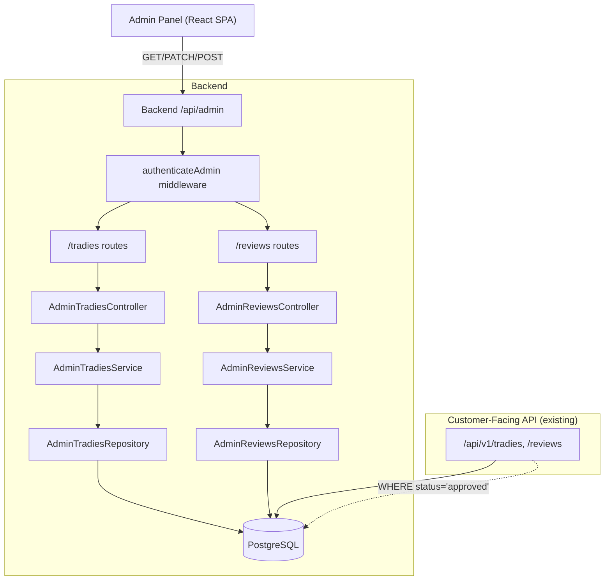

# Design Document

## Overview

This design specifies two new admin moderation modules — **Admin Tradies** and **Admin Reviews** — that plug into the existing LocalLoom admin panel and backend. Both modules implement an approval workflow: content submitted by users (tradie profiles and customer reviews) is reviewed by an administrator before becoming publicly visible.

The modules follow the established patterns exactly: backend modules use the controller → service → repository → validation → routes structure under `authenticateAdmin` middleware; frontend feature modules use the repository → types → schema → hooks → pages → components structure with React Query v5 and shadcn/ui.

### Design Goals

| Goal | Requirements |
|---|---|
| Paginated, filterable list views for tradies and reviews | 1, 5 |
| Detail dialogs showing full profile/review information | 2, 6 |
| Approve/reject workflow with rejection reason prompt | 3, 7 |
| Bulk approve/reject with partial failure handling | 4, 8 |
| Backend REST endpoints following existing admin module pattern | 9, 10 |
| Visibility rules enforced at query level (existing pattern) | 11 |
| Seamless integration with existing admin panel shell | 12 |

### Key Design Decisions

1. **Bulk endpoints use POST with ID arrays** rather than individual PATCH calls. This reduces network round-trips and lets the backend handle partial failures atomically, returning a summary of successes/failures.
2. **Status filter is a query parameter** (`?status=pending`) on the list endpoints rather than separate endpoints per status. This matches the pagination pattern and keeps the API surface small.
3. **Frontend uses server-side pagination and filtering** — the Data_Table sends page/limit/status/search params to the backend rather than fetching all records and filtering client-side. This scales with data volume.
4. **ADMIN_PATHS extensions** add `approve`, `reject`, `bulkApprove`, `bulkReject` path helpers to the existing `tradies` and `reviews` entries.
5. **Rejection reason dialog** is a shared component pattern (AlertDialog with textarea) reused by both modules.

---

## Architecture

### System Context



### Frontend Module Structure

```
src/features/tradies/
├── tradies.repository.ts
├── tradies.types.ts
├── tradies.schema.ts
├── hooks/
│   ├── use-tradies-query.ts
│   ├── use-tradie-detail-query.ts
│   ├── use-approve-tradie-mutation.ts
│   ├── use-reject-tradie-mutation.ts
│   ├── use-bulk-approve-tradies-mutation.ts
│   └── use-bulk-reject-tradies-mutation.ts
├── pages/
│   └── tradies-page.tsx
├── components/
│   ├── tradie-detail-dialog.tsx
│   ├── tradie-reject-dialog.tsx
│   └── tradie-bulk-toolbar.tsx
└── index.ts

src/features/reviews/
├── reviews.repository.ts
├── reviews.types.ts
├── reviews.schema.ts
├── hooks/
│   ├── use-reviews-query.ts
│   ├── use-review-detail-query.ts
│   ├── use-approve-review-mutation.ts
│   ├── use-reject-review-mutation.ts
│   ├── use-bulk-approve-reviews-mutation.ts
│   └── use-bulk-reject-reviews-mutation.ts
├── pages/
│   └── reviews-page.tsx
├── components/
│   ├── review-detail-dialog.tsx
│   ├── review-reject-dialog.tsx
│   └── review-bulk-toolbar.tsx
└── index.ts
```

### Backend Module Structure

```
src/modules/admin-tradies/
├── admin-tradies.controller.ts
├── admin-tradies.service.ts
├── admin-tradies.repository.ts
├── admin-tradies.validation.ts
├── admin-tradies.routes.ts
└── index.ts

src/modules/admin-reviews/
├── admin-reviews.controller.ts
├── admin-reviews.service.ts
├── admin-reviews.repository.ts
├── admin-reviews.validation.ts
├── admin-reviews.routes.ts
└── index.ts
```

---

## Components and Interfaces

### Backend API Endpoints

#### Admin Tradies API (Requirement 9)

| Method | Path | Description | Request | Response |
|--------|------|-------------|---------|----------|
| GET | `/api/admin/tradies` | List tradies (paginated) | Query: `page`, `limit`, `status`, `search` | `PaginatedResult<TradieListItem>` |
| GET | `/api/admin/tradies/:id` | Get tradie detail | Param: `id` (UUID) | `TradieDetail` |
| PATCH | `/api/admin/tradies/:id/approve` | Approve tradie | Param: `id` (UUID) | `{ profileStatus: 'approved' }` |
| PATCH | `/api/admin/tradies/:id/reject` | Reject tradie | Body: `{ rejectionReason: string }` | `{ profileStatus: 'rejected' }` |
| POST | `/api/admin/tradies/bulk-approve` | Bulk approve | Body: `{ ids: string[] }` | `{ processed: number, failed: number }` |
| POST | `/api/admin/tradies/bulk-reject` | Bulk reject | Body: `{ ids: string[], rejectionReason: string }` | `{ processed: number, failed: number }` |

#### Admin Reviews API (Requirement 10)

| Method | Path | Description | Request | Response |
|--------|------|-------------|---------|----------|
| GET | `/api/admin/reviews` | List reviews (paginated) | Query: `page`, `limit`, `status`, `search` | `PaginatedResult<ReviewListItem>` |
| GET | `/api/admin/reviews/:id` | Get review detail | Param: `id` (UUID) | `ReviewDetail` |
| PATCH | `/api/admin/reviews/:id/approve` | Approve review | Param: `id` (UUID) | `{ status: 'approved' }` |
| PATCH | `/api/admin/reviews/:id/reject` | Reject review | Body: `{ rejectionReason: string }` | `{ status: 'rejected' }` |
| POST | `/api/admin/reviews/bulk-approve` | Bulk approve | Body: `{ ids: string[] }` | `{ processed: number, failed: number }` |
| POST | `/api/admin/reviews/bulk-reject` | Bulk reject | Body: `{ ids: string[], rejectionReason: string }` | `{ processed: number, failed: number }` |

### Backend Validation Schemas (Joi)

```typescript
// admin-tradies.validation.ts
export const tradieIdParamSchema = Joi.object({
  id: Joi.string().uuid().required(),
});

export const tradieListQuerySchema = Joi.object({
  page: Joi.number().integer().min(1).default(1),
  limit: Joi.number().integer().min(1).max(100).default(10),
  status: Joi.string().valid('pending', 'approved', 'rejected').optional(),
  search: Joi.string().trim().max(200).optional(),
});

export const rejectTradieSchema = Joi.object({
  rejectionReason: Joi.string().trim().min(1).max(1000).required(),
});

export const bulkApproveSchema = Joi.object({
  ids: Joi.array().items(Joi.string().uuid()).min(1).max(50).required(),
});

export const bulkRejectSchema = Joi.object({
  ids: Joi.array().items(Joi.string().uuid()).min(1).max(50).required(),
  rejectionReason: Joi.string().trim().min(1).max(1000).required(),
});
```

```typescript
// admin-reviews.validation.ts
export const reviewIdParamSchema = Joi.object({
  id: Joi.string().uuid().required(),
});

export const reviewListQuerySchema = Joi.object({
  page: Joi.number().integer().min(1).default(1),
  limit: Joi.number().integer().min(1).max(100).default(10),
  status: Joi.string().valid('pending', 'approved', 'rejected').optional(),
  search: Joi.string().trim().max(200).optional(),
});

export const rejectReviewSchema = Joi.object({
  rejectionReason: Joi.string().trim().min(1).max(1000).required(),
});

export const bulkApproveReviewsSchema = Joi.object({
  ids: Joi.array().items(Joi.string().uuid()).min(1).max(50).required(),
});

export const bulkRejectReviewsSchema = Joi.object({
  ids: Joi.array().items(Joi.string().uuid()).min(1).max(50).required(),
  rejectionReason: Joi.string().trim().min(1).max(1000).required(),
});
```

### Backend Service Logic

```typescript
// AdminTradiesService (pseudocode)
class AdminTradiesService {
  async list(query: { page, limit, status?, search? }): Promise<PaginatedResult<TradieListItem>>
  async getById(id: string): Promise<TradieDetail>  // throws NotFoundException
  async approve(id: string): Promise<TradieProfile>  // throws NotFoundException
  async reject(id: string, rejectionReason: string): Promise<TradieProfile>  // throws NotFoundException
  async bulkApprove(ids: string[]): Promise<{ processed: number; failed: number }>
  async bulkReject(ids: string[], rejectionReason: string): Promise<{ processed: number; failed: number }>
}

// AdminReviewsService (pseudocode)
class AdminReviewsService {
  async list(query: { page, limit, status?, search? }): Promise<PaginatedResult<ReviewListItem>>
  async getById(id: string): Promise<ReviewDetail>  // throws NotFoundException
  async approve(id: string, adminId: string): Promise<Review>  // throws NotFoundException
  async reject(id: string, rejectionReason: string, adminId: string): Promise<Review>  // throws NotFoundException
  async bulkApprove(ids: string[], adminId: string): Promise<{ processed: number; failed: number }>
  async bulkReject(ids: string[], rejectionReason: string, adminId: string): Promise<{ processed: number; failed: number }>
}
```

### Backend Repository Queries

```typescript
// AdminTradiesRepository
class AdminTradiesRepository {
  async findAll(options: { page, limit, status?, search? }): Promise<PaginatedResult<TradieProfile>> {
    // WHERE clause: optional profileStatus filter, optional ILIKE on businessName/abn
    // INCLUDE: user (name, email), services (categories), serviceRegions
    // ORDER BY: createdAt DESC
  }

  async findById(id: string): Promise<TradieProfile | null> {
    // INCLUDE: user, services, serviceRegions, workPhotos
  }

  async updateStatus(id: string, status: string, rejectionReason?: string): Promise<TradieProfile | null> {
    // UPDATE tradie_profiles SET profileStatus = status, rejectionReason = reason WHERE id = id
  }
}

// AdminReviewsRepository
class AdminReviewsRepository {
  async findAll(options: { page, limit, status?, search? }): Promise<PaginatedResult<Review>> {
    // INCLUDE: customer (User: name), tradieProfile (businessName)
    // WHERE: optional status filter, optional ILIKE on customer.name or tradieProfile.businessName
    // ORDER BY: createdAt DESC
  }

  async findById(id: string): Promise<Review | null> {
    // INCLUDE: customer (User: name, email, avatar), tradieProfile (id, businessName)
  }

  async updateStatus(id: string, data: { status, rejectionReason?, reviewedByAdmin?, reviewedAt? }): Promise<Review | null>
}
```

### Frontend ADMIN_PATHS Extensions

```typescript
// Updated ADMIN_PATHS entries
tradies: {
  root: "/tradies",
  byId: (id: string) => `/tradies/${id}`,
  approve: (id: string) => `/tradies/${id}/approve`,
  reject: (id: string) => `/tradies/${id}/reject`,
  bulkApprove: "/tradies/bulk-approve",
  bulkReject: "/tradies/bulk-reject",
},
reviews: {
  root: "/reviews",
  byId: (id: string) => `/reviews/${id}`,
  approve: (id: string) => `/reviews/${id}/approve`,
  reject: (id: string) => `/reviews/${id}/reject`,
  bulkApprove: "/reviews/bulk-approve",
  bulkReject: "/reviews/bulk-reject",
},
```

### Frontend TypeScript Interfaces

```typescript
// src/features/tradies/tradies.types.ts

export type ApprovalStatus = 'pending' | 'approved' | 'rejected';

export interface TradieListItem {
  id: string;
  businessName: string | null;
  abn: string;
  profileStatus: ApprovalStatus;
  createdAt: string;
  user: { id: string; name: string; email: string };
  services: { id: string; name: string }[];
  serviceRegions: { id: string; name: string }[];
}

export interface TradieDetail extends TradieListItem {
  businessLocation: string | null;
  serviceDescription: string | null;
  website: string | null;
  businessImages: string[] | null;
  abnVerified: boolean;
  abnData: { businessName?: string; status?: string; entityType?: string } | null;
  yearsOfExperience: number;
  bio: string | null;
  introVideoUrl: string | null;
  awards: string | null;
  profilePhoto: string | null;
  serviceRadiusKm: number | null;
  tradeLicenseUrl: string | null;
  publicLiabilityInsuranceUrl: string | null;
  idProofUrl: string | null;
  rejectionReason: string | null;
  hasLicense: boolean;
  licenseNumber: string | null;
  licenseExpiryDate: string | null;
  insuranceUrl: string | null;
  insuranceExpiryDate: string | null;
  insuranceVerified: boolean;
  timeFrom: string | null;
  timeTo: string | null;
  openDays: string[] | null;
  isAvailable: boolean;
  isEmergencyAvailable: boolean;
  workPhotos: { id: string; imageUrl: string; sortOrder: number }[];
}

export interface TradieListParams {
  page: number;
  limit: number;
  status?: ApprovalStatus;
  search?: string;
}

export interface BulkActionResult {
  processed: number;
  failed: number;
}
```

```typescript
// src/features/reviews/reviews.types.ts

export type ApprovalStatus = 'pending' | 'approved' | 'rejected';

export interface ReviewListItem {
  id: string;
  rating: number;
  comment: string | null;
  status: ApprovalStatus;
  createdAt: string;
  customer: { id: string; name: string };
  tradieProfile: { id: string; businessName: string };
}

export interface ReviewDetail extends ReviewListItem {
  customer: { id: string; name: string; email: string; avatar: string | null };
  tradieProfile: { id: string; businessName: string };
  rejectionReason: string | null;
  reviewedByAdmin: string | null;
  reviewedAt: string | null;
}

export interface ReviewListParams {
  page: number;
  limit: number;
  status?: ApprovalStatus;
  search?: string;
}

export interface BulkActionResult {
  processed: number;
  failed: number;
}
```

### Frontend Repository Classes

```typescript
// src/features/tradies/tradies.repository.ts
export class AdminTradiesRepository {
  async list(params: TradieListParams): Promise<PaginatedResult<TradieListItem>> {
    const res = await apiClient.get(ADMIN_PATHS.tradies.root, { params });
    return res.data.data;
  }

  async getById(id: string): Promise<TradieDetail> {
    const res = await apiClient.get(ADMIN_PATHS.tradies.byId(id));
    return res.data.data;
  }

  async approve(id: string): Promise<void> {
    await apiClient.patch(ADMIN_PATHS.tradies.approve(id));
  }

  async reject(id: string, rejectionReason: string): Promise<void> {
    await apiClient.patch(ADMIN_PATHS.tradies.reject(id), { rejectionReason });
  }

  async bulkApprove(ids: string[]): Promise<BulkActionResult> {
    const res = await apiClient.post(ADMIN_PATHS.tradies.bulkApprove, { ids });
    return res.data.data;
  }

  async bulkReject(ids: string[], rejectionReason: string): Promise<BulkActionResult> {
    const res = await apiClient.post(ADMIN_PATHS.tradies.bulkReject, { ids, rejectionReason });
    return res.data.data;
  }
}
export const adminTradiesRepository = new AdminTradiesRepository();
```

```typescript
// src/features/reviews/reviews.repository.ts
export class AdminReviewsRepository {
  async list(params: ReviewListParams): Promise<PaginatedResult<ReviewListItem>> {
    const res = await apiClient.get(ADMIN_PATHS.reviews.root, { params });
    return res.data.data;
  }

  async getById(id: string): Promise<ReviewDetail> {
    const res = await apiClient.get(ADMIN_PATHS.reviews.byId(id));
    return res.data.data;
  }

  async approve(id: string): Promise<void> {
    await apiClient.patch(ADMIN_PATHS.reviews.approve(id));
  }

  async reject(id: string, rejectionReason: string): Promise<void> {
    await apiClient.patch(ADMIN_PATHS.reviews.reject(id), { rejectionReason });
  }

  async bulkApprove(ids: string[]): Promise<BulkActionResult> {
    const res = await apiClient.post(ADMIN_PATHS.reviews.bulkApprove, { ids });
    return res.data.data;
  }

  async bulkReject(ids: string[], rejectionReason: string): Promise<BulkActionResult> {
    const res = await apiClient.post(ADMIN_PATHS.reviews.bulkReject, { ids, rejectionReason });
    return res.data.data;
  }
}
export const adminReviewsRepository = new AdminReviewsRepository();
```

### React Query Hooks

```typescript
// Query keys extension in src/lib/query-keys.ts
export const queryKeys = {
  // ... existing keys
  tradies: {
    all: () => ["admin", "tradies"] as const,
    list: (params: TradieListParams) => ["admin", "tradies", "list", params] as const,
    detail: (id: string) => ["admin", "tradies", "detail", id] as const,
  },
  reviews: {
    all: () => ["admin", "reviews"] as const,
    list: (params: ReviewListParams) => ["admin", "reviews", "list", params] as const,
    detail: (id: string) => ["admin", "reviews", "detail", id] as const,
  },
};
```

```typescript
// use-tradies-query.ts
export function useTradiesQuery(params: TradieListParams) {
  return useQuery({
    queryKey: queryKeys.tradies.list(params),
    queryFn: () => adminTradiesRepository.list(params),
  });
}

// use-tradie-detail-query.ts
export function useTradieDetailQuery(id: string | null) {
  return useQuery({
    queryKey: queryKeys.tradies.detail(id!),
    queryFn: () => adminTradiesRepository.getById(id!),
    enabled: !!id,
  });
}

// use-approve-tradie-mutation.ts
export function useApproveTradieMutation() {
  const qc = useQueryClient();
  return useMutation({
    mutationFn: (id: string) => adminTradiesRepository.approve(id),
    onSuccess: () => {
      qc.invalidateQueries({ queryKey: queryKeys.tradies.all() });
      toast({ title: "Tradie approved" });
    },
    onError: useApiErrorToast(),
  });
}

// use-bulk-approve-tradies-mutation.ts
export function useBulkApproveTradiesMutation() {
  const qc = useQueryClient();
  return useMutation({
    mutationFn: (ids: string[]) => adminTradiesRepository.bulkApprove(ids),
    onSuccess: (result) => {
      qc.invalidateQueries({ queryKey: queryKeys.tradies.all() });
      toast({ title: `${result.processed} tradies approved${result.failed ? `, ${result.failed} failed` : ''}` });
    },
    onError: useApiErrorToast(),
  });
}
```

### Frontend Component Specifications

#### TradiesPage

- PageHeader with title "Tradies" and description
- Status filter tabs (All / Pending / Approved / Rejected)
- Search input for business name / ABN
- DataTable with columns: checkbox, business name, ABN, category, region, status badge, date, actions
- Row click opens TradieDetailDialog
- Row actions dropdown: Approve / Reject (conditional on current status)
- BulkToolbar appears when rows are selected
- Pagination controls below table

#### TradieDetailDialog

- Full-screen Dialog showing all tradie profile fields organized in sections:
  - Business Info: name, ABN, verification status, description, website, location
  - Services & Regions: category badges, region badges
  - Operating Hours: timeFrom, timeTo, openDays
  - Media: business images gallery, work photos grid, intro video link
  - Documents: trade license, public liability insurance, ID proof (as download links)
  - Status: current status badge, rejection reason (if rejected), submission date
- Action buttons in dialog footer: Approve / Reject (conditional)

#### TradieRejectDialog

- AlertDialog with textarea for rejection reason
- Zod validation: reason required, min 1 char, max 1000 chars
- Confirm/Cancel buttons

#### TradieBulkToolbar

- Floating toolbar showing "{n} selected"
- Bulk Approve button
- Bulk Reject button (opens reject reason dialog)
- Clear selection button

#### ReviewsPage

- Same pattern as TradiesPage
- Columns: checkbox, customer name, tradie name, rating (with star), comment preview (truncated), status badge, date, actions

#### ReviewDetailDialog

- Dialog showing: customer info, tradie reference (link/name), rating with stars, full comment, status, rejection reason
- Action buttons: Approve / Reject (conditional)

#### ReviewRejectDialog

- Same pattern as TradieRejectDialog

#### ReviewBulkToolbar

- Same pattern as TradieBulkToolbar

---

## Data Models

### Backend Response Envelopes

All admin API responses follow the existing envelope pattern:

```typescript
// Success response
{
  success: true,
  message: string,
  data: T
}

// Paginated response
{
  success: true,
  message: string,
  data: {
    data: T[],
    meta: {
      page: number,
      limit: number,
      total: number,
      totalPages: number,
      hasNextPage: boolean,
      hasPrevPage: boolean
    }
  }
}

// Error response
{
  success: false,
  message: string,
  errors?: string[]
}
```

### Database Queries for Visibility (Requirement 11)

The existing public API already enforces visibility rules:

- `TradieRepository.findAllApproved()` uses `WHERE profileStatus = 'approved'`
- `TradieRepository.findByIdPublic()` uses `WHERE profileStatus = 'approved'`
- `TradieRepository.getApprovedReviews()` uses `WHERE status = 'approved'`

These queries remain unchanged. When an admin changes a status from `approved` to `rejected`, the next public API call automatically excludes the record — no additional logic needed.

### Frontend Pagination Type (shared)

```typescript
// src/types/api.ts (add to existing)
export interface PaginatedResult<T> {
  data: T[];
  meta: {
    page: number;
    limit: number;
    total: number;
    totalPages: number;
    hasNextPage: boolean;
    hasPrevPage: boolean;
  };
}
```


---

## Correctness Properties

*A property is a characteristic or behavior that should hold true across all valid executions of a system — essentially, a formal statement about what the system should do. Properties serve as the bridge between human-readable specifications and machine-verifiable correctness guarantees.*

### Property 1: Bulk action count invariant

*For any* bulk approve or bulk reject operation on a set of IDs, the sum of `processed` + `failed` in the response SHALL always equal the total number of IDs submitted in the request.

**Validates: Requirements 4.5, 8.5**

### Property 2: Non-approved tradie exclusion

*For any* tradie profile with `profileStatus` not equal to `'approved'`, querying the public-facing tradie listing or detail endpoints SHALL never return that profile in the results.

**Validates: Requirements 11.1, 11.3**

### Property 3: Non-approved review exclusion

*For any* review with `status` not equal to `'approved'`, querying the public-facing review endpoints SHALL never return that review in the results.

**Validates: Requirements 11.2, 11.4**

---

## Error Handling

### Backend Error Responses

| Scenario | HTTP Status | Error Message |
|----------|-------------|---------------|
| Tradie/Review not found | 404 | "Tradie profile not found" / "Review not found" |
| Invalid UUID param | 400 | Joi validation error with field details |
| Missing rejection reason | 400 | Joi validation error: "rejectionReason is required" |
| Bulk IDs array empty | 400 | Joi validation error: "ids must contain at least 1 item" |
| Bulk IDs array > 50 | 400 | Joi validation error: "ids must contain at most 50 items" |
| Unauthenticated request | 401 | "Unauthorized" (from authenticateAdmin middleware) |
| Database error | 500 | "Internal server error" (generic, logged server-side) |

### Frontend Error Handling

- **API errors** are normalized to `ApiError` by the axios response interceptor
- **Toast notifications** display the error message for all failed mutations
- **Bulk operations** show partial success: "X approved, Y failed" when some IDs fail
- **Network errors** show a generic "Network error. Please try again." toast
- **404 on detail fetch** closes the dialog and shows "Record not found" toast

### Bulk Operation Failure Strategy

The backend processes each ID independently in a loop. If one fails (e.g., record not found), it increments the `failed` counter and continues with the remaining IDs. This ensures partial success rather than all-or-nothing behavior.

```typescript
// Pseudocode for bulk operation
async bulkApprove(ids: string[]): Promise<{ processed: number; failed: number }> {
  let processed = 0;
  let failed = 0;
  for (const id of ids) {
    try {
      const record = await this.repo.findById(id);
      if (!record) { failed++; continue; }
      await this.repo.updateStatus(id, 'approved');
      processed++;
    } catch {
      failed++;
    }
  }
  return { processed, failed };
}
```

---

## Testing Strategy

### Unit Tests (Example-Based)

**Backend:**
- Service layer tests with mocked repository
- Validation schema tests (valid/invalid inputs)
- Controller tests verifying correct service calls and response shapes

**Frontend:**
- Component rendering tests (DataTable columns, DetailDialog fields, status badges)
- Hook tests with mocked repository (React Query + MSW or manual mocks)
- Conditional action button rendering based on status
- Bulk toolbar visibility based on selection state
- Toast notifications on success/error

### Integration Tests

**Backend:**
- Full endpoint tests with test database
- Auth middleware enforcement (401 without token)
- Pagination, filtering, and search behavior
- Status transitions (pending → approved, approved → rejected, etc.)
- Bulk operations with mix of valid/invalid IDs

**Frontend:**
- Page-level tests with MSW intercepting API calls
- Full approval/rejection flow (click → dialog → confirm → toast)
- Bulk selection → bulk action → result toast flow

### Property-Based Tests

Property-based testing applies to a limited subset of this feature (bulk operation invariants and visibility rules). Use `fast-check` for the TypeScript/Node.js backend tests.

**Configuration:**
- Minimum 100 iterations per property test
- Tag format: `Feature: tradi-review-admin-modules, Property {number}: {property_text}`

**Property 1 test:** Generate random arrays of UUIDs (mix of existing and non-existing IDs), call bulk approve/reject, assert `processed + failed === ids.length`.

**Property 2 test:** Generate random tradie profiles with random statuses, insert into test DB, call public listing endpoint, assert no non-approved profiles appear in results.

**Property 3 test:** Generate random reviews with random statuses, insert into test DB, call public review endpoint, assert no non-approved reviews appear in results.

### Test Coverage Priorities

1. **Critical path:** Approve/reject single record (backend service + frontend mutation)
2. **Bulk operations:** Partial failure handling
3. **Visibility rules:** Public API exclusion of non-approved records
4. **UI rendering:** Status-conditional action buttons
5. **Error handling:** Toast display on API failures
